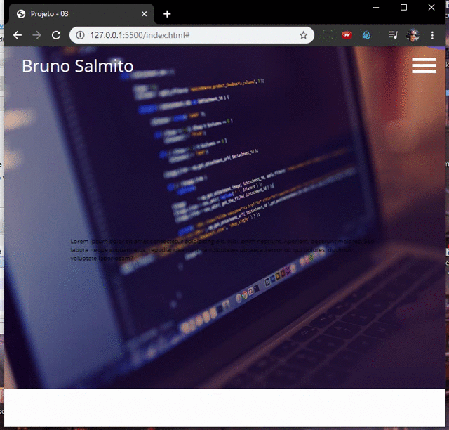

# Website
> Website single page/.
> Versão: 0.1

[![NPM Version][npm-image]][npm-url]
[![Build Status][travis-image]][travis-url]
[![Downloads Stats][npm-downloads]][npm-url]

* Web site institucional single page, este `website` é um mero exemplo e pode ser modificada.


## Menu Mobile




* CSS -> *css/style.css*, arquivo contendo a estilização do site.


* menu.js -> *js/menu.js*, script que controla a animação parao menu mobile.

```
let show = true;
const menuSection = document.querySelector(".menuSection");
const menuToogle = document.querySelector(".menuSection nav");
const links = document.querySelectorAll(".menuToogle nav.open li");

menuSection.addEventListener('click', () => {
    document.body.style.overflow = show ? "hidden" : "initial";
    menuToogle.classList.toggle('open', show);
    menuSection.classList.toggle('on', show);
    show = !show;
});
```

* map.js -> *js/map.js*, script que gera o google maps no site.
** Obs: colocar sua Key do google maps no index.html para funcionar

```
function initMap() {
    // Define a lat e lng da cidade onde o mapa ficará centralizado
    var cidade = {
        lat: -3.721039, //Latitude da cidade
        lng: -40.991223 //Longitude da cidade
    };

    // Centraliza o mapa nas coordenadas da var cidade
    var map = new google.maps.Map(
        document.getElementById('map'), {
            zoom: 13,
            center: cidade,
            //Desabilita o scrool do mouse sobre o mapa
            scrollwheel: false,
            styles: [{
                stylers: [{
                    //Deixa o mapa branco
                    //saturation: -100
                }]
            }]

        }); //fim do construtor do mapa

    // função para adicionar marker no mapa
    function addMkarker(lat, lng, tit) {
        //var info = '<h1 id="firstHeading" class="firstHeading">Uluru</h1>';
        var info = tit;

        var myLatLng = {
            lat,
            lng
        };

        var infoWindow = new google.maps.InfoWindow({
            content: info
        });

        var marker = new google.maps.Marker({
            position: myLatLng,
            title: tit,
            map: map

        });

        marker.addListener('click', function () {
            infoWindow.open(map, marker);
        });


    } //fim da função addMarker

    addMkarker(-3.7334475, -41.0025494, 'Bruno Salmito');


} //Fim da initMap
initMap();

```

## Próximas implatações

* Salvar dados do formulário no banco de dados.
* Implantar PHP Mailer.
* Implatar máscara no formulário.
* Painel administrativo com dashboard.
* Slider para equipe / depoimentos.
* Slider para os links da página.


## Configuração para Desenvolvimento

Basta clonar ou fazer o download do repositório e mexer a vontade.


## Histórico de lançamentos

* 0.0.2
    * MUDANÇA: Atualização do css (código do módulo permanece inalterado)
* 0.0.1
    * Trabalho em andamento

## Meta

Bruno Salmito – [@bruno.salmito.5](https://web.facebook.com/bruno.salmito.5) – brunosalmito@gmail.com

Distribuído sob a licença MIT. Veja `LICENSE` para mais informações.

[https://github.com/bruno-salmito/github-link](https://github.com/bruno-salmito/)

## Contributing

1. Faça o _fork_ do projeto (<https://github.com/bruno-salmito/WebSite-SinglePage/fork>)
2. Crie uma _branch_ para sua modificação (`git checkout -b feature/fooBar`)
3. Faça o _commit_ (`git commit -am 'Add some fooBar'`)
4. _Push_ (`git push origin feature/fooBar`)
5. Crie um novo _Pull Request_

[npm-image]: https://img.shields.io/npm/v/datadog-metrics.svg?style=flat-square
[npm-url]: https://npmjs.org/package/datadog-metrics
[npm-downloads]: https://img.shields.io/npm/dm/datadog-metrics.svg?style=flat-square
[travis-image]: https://img.shields.io/travis/dbader/node-datadog-metrics/master.svg?style=flat-square
[travis-url]: https://travis-ci.org/dbader/node-datadog-metrics
[wiki]: https://github.com/bruno-salmito/WebSite-SinglePage/wiki
